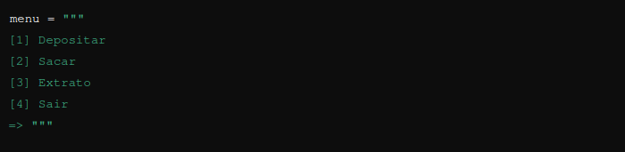
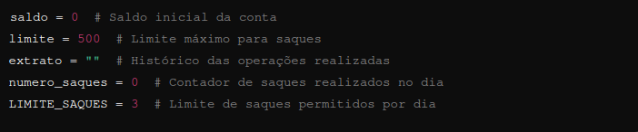
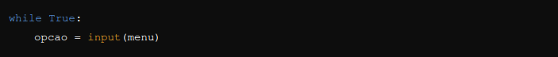
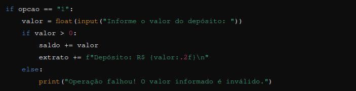
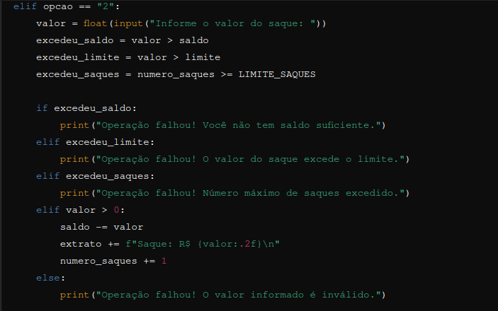
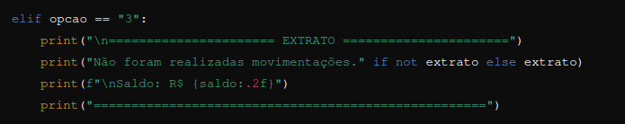
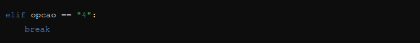
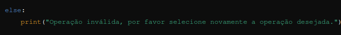

# Criando Um Sistema Bancario

### Sistema de Menu para Operações Bancárias

Este projeto é um exemplo simples de um sistema de menu interativo para operações bancárias, desenvolvido em Python. O sistema permite ao usuário realizar depósitos, saques, visualizar o extrato de transações e encerrar o programa.

### Funcionalidades
Depósito: O usuário pode depositar um valor na conta.
Saque: O usuário pode sacar um valor da conta, respeitando o saldo disponível, o limite de saque por operação e o número máximo de saques diários.
Extrato: O usuário pode visualizar o histórico das transações realizadas e o saldo atual.
Sair: O usuário pode encerrar o programa.
Como o Código Funciona

###     1. Exibição do Menu
O código começa definindo o menu de opções que será exibido ao usuário. O menu é uma string que contém as quatro operações disponíveis:

### 2. Inicialização de Variáveis
Antes de entrar no loop principal do programa, são inicializadas várias variáveis que manterão o controle do saldo da conta, do limite de saque, do extrato de transações e do número de saques realizados:

### 3. Loop Principal
O programa entra em um loop infinito que mantém o menu em exibição até que o usuário escolha a opção de sair (opcao == "4").

### 4. Depósito
Se o usuário escolher a opção de depósito (opcao == "1"), o programa solicita o valor a ser depositado. Se o valor for válido (maior que 0), ele é adicionado ao saldo da conta, e a transação é registrada no extrato.

### 5. Saque
Se o usuário escolher a opção de saque (opcao == "2"), o programa realiza várias verificações:

Se o valor do saque não excede o saldo disponível.
Se o valor do saque não excede o limite por operação.
Se o número de saques realizados no dia não excede o limite diário.
Se todas as condições forem atendidas e o valor for válido, o saque é realizado, o saldo é atualizado, e a transação é registrada no extrato.

### 6. Extrato
Se o usuário escolher a opção de extrato (opcao == "3"), o programa exibe o histórico das transações realizadas e o saldo atual. Se não houver transações, uma mensagem informando que não houve movimentações é exibida.

### 7. Sair
Se o usuário escolher a opção de sair (opcao == "4"), o loop é interrompido e o programa é encerrado.

### 8. Opção Inválida
Se o usuário inserir uma opção inválida, o programa exibe uma mensagem de erro e solicita que o usuário tente novamente.

# Conclusão
Este código é um exemplo prático de como construir um sistema simples de menu interativo usando Python. Ele cobre conceitos básicos de programação, como loops, condicionais, manipulação de strings e operações matemáticas, sendo um ótimo ponto de partida para quem está aprendendo a programar.